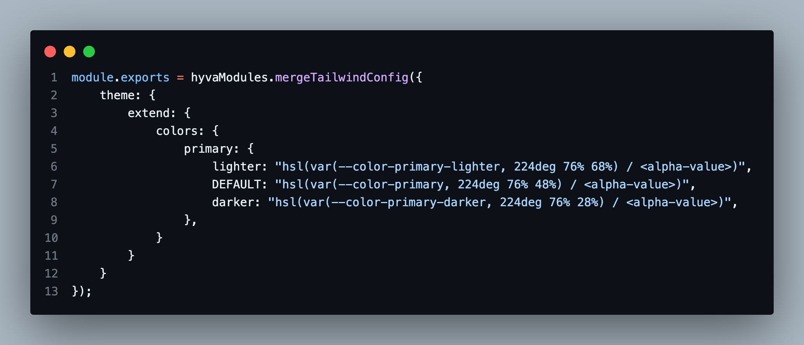
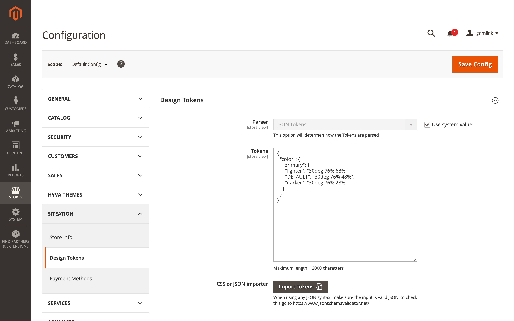

# Siteation - Magento 2 module Theme Tokens

[](https://packagist.org/packages/siteation/magento2-theme-tokens)

[](https://hyva.io/)


This Magento 2 module makes it easy to manage Design Tokens from the Magento backend.

Once you have set your tokens,
they will be output as CSS variables to the frontend,
making it easy to style your website with consistent and reusable code.

## Installation

Install the package via;

```bash
composer require siteation/magento2-theme-tokens
bin/magento setup:upgrade
```

> **Note** This Module requires Magento 2.4 or higher!
> For more requirements see the `composer.json`.

## How to use

Once the module is installed, you can manage your Design Tokens from the Magento backend.

First make sure your styles support CSS variables



After this you can configure your tokens, Go to Stores > Configuration > Siteation > Design Tokens.
Enter your the tokens in the desired format.



Once you have set your tokens, they will be output as CSS variables to the frontend.

| Before       | After        |
| ------------ | ------------ |
| ![preview-1] | ![preview-2] |

[preview-1]: ./assets/default.jpg
[preview-2]: ./assets/with-tokens.jpg
